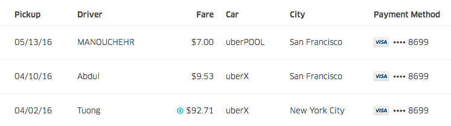
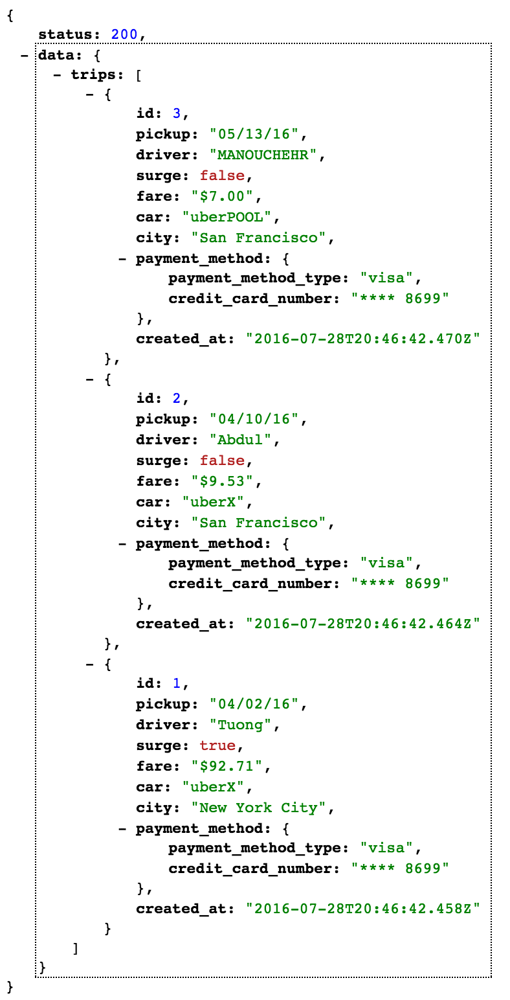

# Ryde-Server for Urbandoor.co

## Build a simple JSON API

Build a `GET /trips` API that powers the trip list view for a ride-sharing web app.



## Getting Started

### Setting Up Postgresql
`psql`  
`CREATE ROLE ryde_admin`  
`ALTER ROLE ryde_admin WITH LOGIN CREATEDB REPLICATION SUPERUSER;`  
`\q`
`rake db:migrate`  
`rake db:setup`  

### Installing Dependencies

To run this code, you must have Rails 5.0 and Ruby 2.3.1 installed. Then you just have to run: 

`bundle install`

### Setting Up The Server

`bundle install`  
`rake db:setup db:migrate db:seed`  

### Running The Server
Run `rails s -p [port#]` to start the server.

### Hosts Files
The API uses a subdomain so if you wish to run this code localle, in your `/etc/hosts` file, you should add:  

```
127.0.0.1       api.localhost.local
127.0.0.1       devapi.localhost.local
```

## The API

All requests to the API should be done through the subdomain: `http://devapi.localhost.local:{PORT#}/`
All API requests default to using an accept header with `application/com.ryde.v1` unless otherwise specified.

### Standard Response Structure

The JSON response is modeled after the [JSend](https://labs.omniti.com/labs/jsend) Standard: 

```
{
    status : 200,
    data : {...}
}

```

### GET /trips


